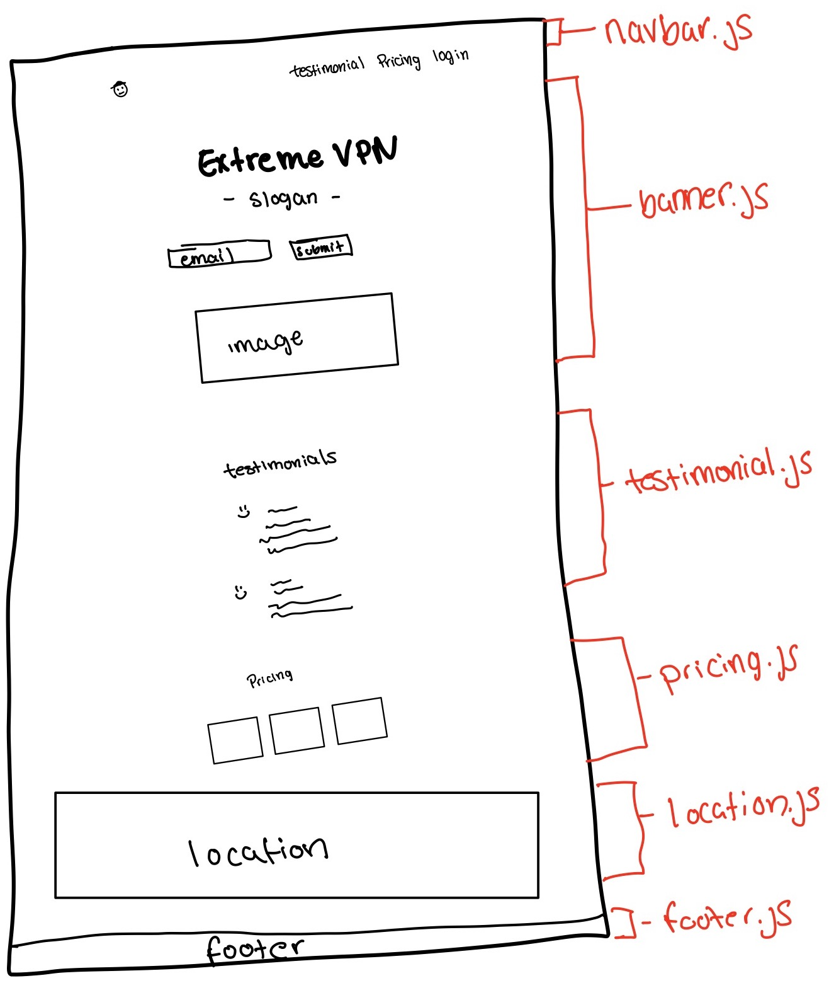
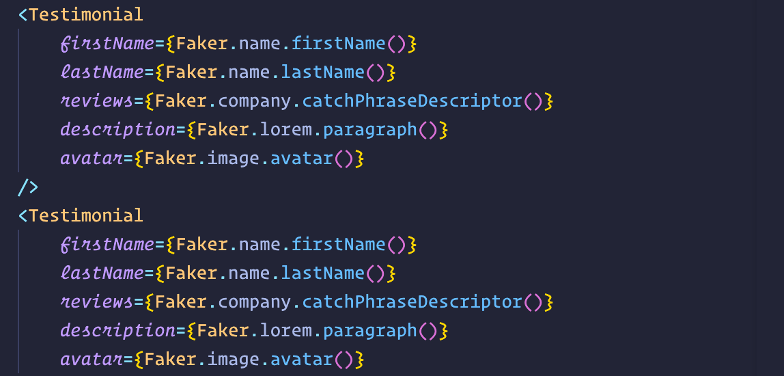

This project was to practice on some of the fundemental concepts I've been learning with ReactJS

## Fundementals This Includes

-   Components
-   State
-   Props
-   Lifecycle Methods such as ComponentDidMount

## Examples of Fundementals

### Components

-   This includes a Navbar, Banner, Section, Location, and a Footer component.
    
    Apologies for the extremely rough drawing

### State

-   Here I utized State by updating the longitude and latitude of the user for the Location component at the bottom.

### Props

-   I imported a library called FakerJS to create the testimonials, I passed each piece of data I wanted from Faker through as a prop for the Testimonial component.
    

# Conclusion

All in all, I had a fun time building this out with React. I will be building out more projects as I learn more.
